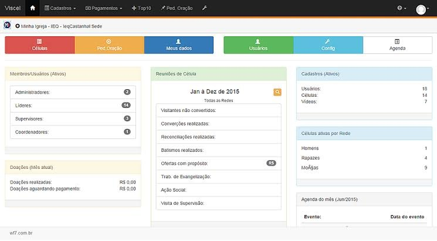
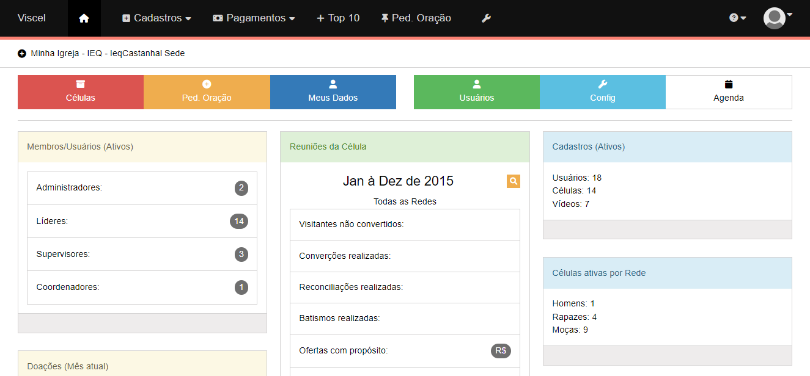

# [Primeira V.A. de Introdução a Computação](https://silvanogpm.github.io/ic-1va/).

Desenvolvimento de uma tela com HTML e CSS.

## :hammer: Como executar localmente?

1. Faça download deste repositório
2. Abra o arquivo index.html com um navegador

## Imagens

Exemplo a ser seguido:

 

Tela desenvolvida:

